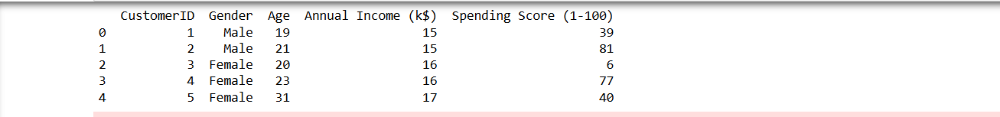

# Implementation-of-K-Means-Clustering-for-Customer-Segmentation

## AIM:
To write a program to implement the K Means Clustering for Customer Segmentation.

## Equipments Required:
1. Hardware – PCs
2. Anaconda – Python 3.7 Installation / Jupyter notebook

## Algorithm
### Algorithm: Implementation of K-Means Clustering for Customer Segmentation

1. **Import Required Libraries**
   Import NumPy, Pandas, Matplotlib, and KMeans from sklearn.

2. **Load the Dataset**
   Read the customer dataset using pandas and select the required features such as Annual Income and Spending Score.

3. **Find Optimal Number of Clusters**
   Use the Elbow Method by calculating WCSS values for different cluster numbers.

4. **Apply K-Means Clustering**
   Initialize the K-Means model with the optimal number of clusters and fit it to the dataset.

5. **Predict Cluster Groups**
   Assign customers to different clusters using the `fit_predict()` method.

6. **Visualize the Clusters**
   Plot the clustered customer groups using a scatter plot with different colors for each cluster.
 

## Program:
```
/*
Program to implement the K Means Clustering for Customer Segmentation.
Developed by: KARNAM PAREESH NAIDU
RegisterNumber:212225230129  
*/
import numpy as np
import pandas as pd
import matplotlib.pyplot as plt
from sklearn.cluster import KMeans

data = pd.read_csv("C:/Mall_Customers.csv")

print(data.head())

X = data.iloc[:, [3, 4]].values

wcss = []

for i in range(1, 11):
    kmeans = KMeans(n_clusters=i, init='k-means++', random_state=42)
    kmeans.fit(X)
    wcss.append(kmeans.inertia_)

plt.figure(figsize=(8, 5))
plt.plot(range(1, 11), wcss, marker='o')
plt.title('Elbow Method')
plt.xlabel('Number of Clusters')
plt.ylabel('WCSS')
plt.show()

kmeans = KMeans(n_clusters=5, init='k-means++', random_state=42)

y_kmeans = kmeans.fit_predict(X)

plt.figure(figsize=(8, 6))

plt.scatter(X[y_kmeans == 0, 0], X[y_kmeans == 0, 1],
            s=100, c='red', label='Cluster 1')

plt.scatter(X[y_kmeans == 1, 0], X[y_kmeans == 1, 1],
            s=100, c='blue', label='Cluster 2')

plt.scatter(X[y_kmeans == 2, 0], X[y_kmeans == 2, 1],
            s=100, c='green', label='Cluster 3')

plt.scatter(X[y_kmeans == 3, 0], X[y_kmeans == 3, 1],
            s=100, c='cyan', label='Cluster 4')

plt.scatter(X[y_kmeans == 4, 0], X[y_kmeans == 4, 1],
            s=100, c='magenta', label='Cluster 5')

plt.title('Customer Segments')
plt.xlabel('Annual Income')
plt.ylabel('Spending Score')
plt.legend()
plt.show()
```

## Output:


## Result:
Thus the program to implement the K Means Clustering for Customer Segmentation is written and verified using python programming.
